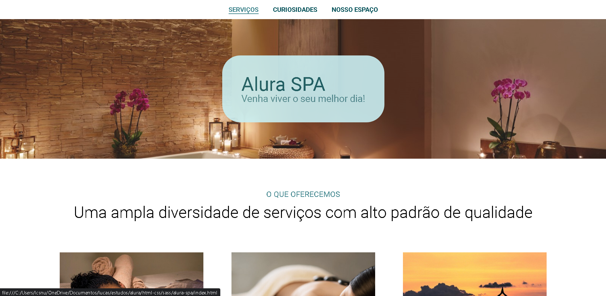

<h1 aling="center">Alura SPA</h1>

    <a href="#tecnologias">Tecnologias</a>&nbsp; &nbsp; &nbsp; | &nbsp; &nbsp; &nbsp;
    <a href="#projeto">Projeto</a>&nbsp; &nbsp; &nbsp; | &nbsp; &nbsp; &nbsp;
    <a href="#memo-licença">Licença</a>

    

 

    

## Tecnologias

Esse projeto foi desenvolvido com as seguintes tecnologias:

- HTML e CSS
- SCSS e SASS
- Git e Github

## Projeto

Projeto constitue em uma lading page de uma página de SPA desenvolvida com SASS durante o curso de SASS da Alura.

## :memo: Licença

Esse projeto está sob a licença MIT.

---

Feito por Lucas Numeriano :wave: 
